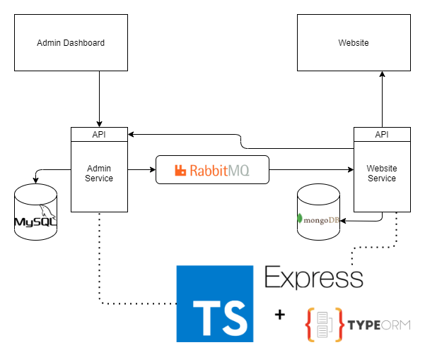

# TypeScipt TypeORM Express Rabbit MQ 
> Example of Running System

## Tech Used


## Architecture



## Run the application

### Prerequisites

- Docker Installed

### Start Application

```sh
# Bring up Docker Compose and Rebuild
docker-compose up --force-recreate
```

### Available Dashboards when Docker Compose is fully Up

- [Admin Swagger](http://localhost:8000/swagger/#/)
- [RabbitQA Dashboard](http://localhost:15672/#/)
- [Mongo Express](http://localhost:8888/)
- [PHP My Admin](http://localhost:5000/)


## Resources

### Tools and Frameworks

- [Express JS](https://expressjs.com/)
- [TypeScript](https://www.typescriptlang.org/)
- [TYPE ORM](https://typeorm.io/#/)
- [Rabbit MQ](https://www.rabbitmq.com/)
- [Docker Compose](https://docs.docker.com/compose/)
- [Swagger JS Docs](https://github.com/Surnet/swagger-jsdoc/blob/v7/docs/FIRST-STEPS.md)
- [Swagger OPEN Api 3](https://swagger.io/docs/specification/describing-request-body/)

### Interesting Articles While Building

- [REST PUT Debate](https://stackoverflow.com/questions/630453/put-vs-post-in-rest)

## Useful Docker Commands

```sh
# Stop all running Docker Containers
docker container stop $(docker container list -q)

# Delete all images
docker rmi -f $(docker images -a -q)

# Delte all existing containers
docker rm $(docker ps -a -q)

# Bring up Docker Compose and Rebuild
docker-compose up --force-recreate
```

## Future Aims
- Idempotent
- Replayable
- Rollback
- Single write per Queue consumer
- DAG of Data Flow
- Socket updates for Rabbit MQ messages to website
